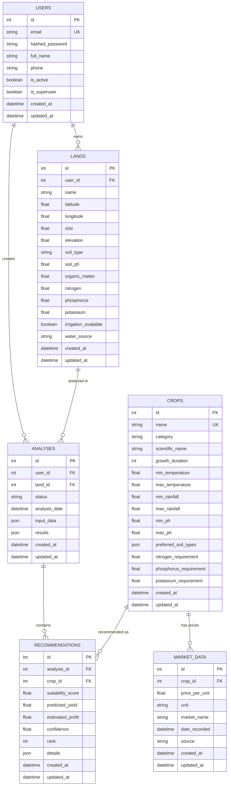

# Database Schema

## ER Diagram



## Tables

### users
Primary table for authentication and user management.

| Column | Type | Constraints | Notes |
|--------|------|-------------|-------|
| id | INTEGER | PK, AUTO | |
| email | VARCHAR(255) | UNIQUE, NOT NULL, IX | Login identifier |
| hashed_password | VARCHAR(255) | NOT NULL | bcrypt hash |
| full_name | VARCHAR(255) | | |
| phone | VARCHAR(20) | | |
| is_active | BOOLEAN | DEFAULT true | Soft delete |
| is_superuser | BOOLEAN | DEFAULT false | Admin flag |
| created_at | TIMESTAMP(TZ) | DEFAULT now() | |
| updated_at | TIMESTAMP(TZ) | DEFAULT now() | Auto-update |

### lands
Physical land parcels owned by users.

| Column | Type | Constraints | Notes |
|--------|------|-------------|-------|
| id | INTEGER | PK | |
| user_id | INTEGER | FK → users.id, IX | CASCADE delete |
| name | VARCHAR(255) | NOT NULL | |
| latitude | FLOAT | | GPS coordinates |
| longitude | FLOAT | | GPS coordinates |
| size | FLOAT | | Hectares |
| elevation | FLOAT | | Meters above sea level |
| soil_type | VARCHAR(50) | | loamy, clay, sandy, etc. |
| soil_ph | FLOAT | | 0-14 scale |
| organic_matter | FLOAT | | Percentage |
| nitrogen | FLOAT | | kg/ha |
| phosphorus | FLOAT | | kg/ha |
| potassium | FLOAT | | kg/ha |
| irrigation_available | BOOLEAN | DEFAULT false | |
| water_source | VARCHAR(50) | | well, canal, rain, etc. |

### crops
Crop reference data (seeded from `crop_requirements.json`).

| Column | Type | Constraints | Notes |
|--------|------|-------------|-------|
| id | INTEGER | PK | |
| name | VARCHAR(100) | UNIQUE, NOT NULL | |
| category | VARCHAR(50) | | cereal, pulse, oilseed, etc. |
| preferred_soil_types | JSON | | Array of soil types |
| min/max_temperature | FLOAT | | °C optimal range |
| min/max_rainfall | FLOAT | | mm/year optimal range |
| min/max_ph | FLOAT | | pH optimal range |
| N/P/K_requirement | FLOAT | | kg/ha minimum |
| growth_duration | INTEGER | | Days to harvest |

### analyses
ML analysis runs linking a user and a land parcel.

| Column | Type | Constraints | Notes |
|--------|------|-------------|-------|
| id | INTEGER | PK | |
| user_id | INTEGER | FK → users.id, IX | CASCADE |
| land_id | INTEGER | FK → lands.id, IX | CASCADE |
| status | VARCHAR(20) | DEFAULT 'pending' | pending/completed/failed |
| input_data | JSON | | Original ML input |
| results | JSON | | Full analysis results |
| analysis_date | TIMESTAMP(TZ) | | |

### recommendations
Per-crop results from an analysis.

| Column | Type | Constraints | Notes |
|--------|------|-------------|-------|
| id | INTEGER | PK | |
| analysis_id | INTEGER | FK → analyses.id, IX | CASCADE |
| crop_id | INTEGER | FK → crops.id | CASCADE |
| suitability_score | FLOAT | | 0-100 |
| predicted_yield | FLOAT | | tons/ha |
| estimated_profit | FLOAT | | INR/ha |
| confidence | FLOAT | | 0-1 |
| rank | INTEGER | | Position in recommendations |
| details | JSON | | Score breakdown |

### market_data
Historical market prices per crop.

| Column | Type | Constraints | Notes |
|--------|------|-------------|-------|
| id | INTEGER | PK | |
| crop_id | INTEGER | FK → crops.id, IX | CASCADE |
| price_per_unit | FLOAT | | INR per unit |
| unit | VARCHAR(20) | | ton, quintal, etc. |
| market_name | VARCHAR(100) | | Market location |
| date_recorded | TIMESTAMP(TZ) | | |
| source | VARCHAR(100) | | Data source name |

## Indexes

| Table | Index | Columns |
|-------|-------|---------|
| users | ix_users_email | email (unique) |
| lands | ix_lands_user_id | user_id |
| analyses | ix_analyses_user_id | user_id |
| analyses | ix_analyses_land_id | land_id |
| recommendations | ix_recommendations_analysis_id | analysis_id |
| market_data | ix_market_data_crop_id | crop_id |

## Migrations

```bash
# Apply all migrations
alembic upgrade head

# Rollback last migration
alembic downgrade -1

# Create new migration
alembic revision --autogenerate -m "description"

# View current revision
alembic current
```
